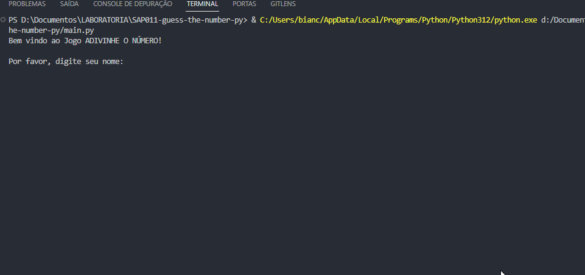

# Guess The Number - Python 🐍

Jogo simples em que você tenta adivinhar um número secreto entre 1 e 100. Você pode jogar contra o computador, revezando a cada round até que o número secreto seja inserido. Não há limites de round, quando o número secreto for descoberto será printado no terminal o número, suas tentativas e as tentativas da máquina. Voce ainda pode escolher se quer reiniciar a partida ou finalizar o jogo.

## Como Jogar

1. Clone este repositório ou baixe o arquivo do script `SAP011-guess-the-number.py`.
2. Certifique-se de ter o Python instalado em seu sistema.
3. Execute o script `SAP011-guess-the-number.py` em seu terminal ou ambiente de desenvolvimento Python.
4. Siga as instruções no terminal para jogar o jogo.

## Funcionalidades

- **Modo de Jogo:** Você pode jogar contra o computador.
- **Modo de Início Aleatório:** O jogo escolhe aleatoriamente quem começa primeiro.
- **Palpites Registrados:** Os palpites feitos pelo jogador e pelo computador são registrados e exibidos no final do jogo.
- **Opção de Reinício:** Após cada jogo, você tem a opção de jogar novamente ou sair do jogo.

## Demo 🎲🎮

  

## Como Contribuir

Se você quiser contribuir com melhorias para este jogo, siga estes passos:

1. Faça um fork deste repositório.
2. Crie uma branch para sua feature: `git checkout -b feature-nova`.
3. Faça commit das suas alterações: `git commit -m 'Adiciona nova funcionalidade'`.
4. Faça push para a branch: `git push origin feature-nova`.
5. Abra um Pull Request.

## Tecnologias Utilizadas

- Python
- Biblioteca Random (para geração de números aleatórios)

## Autor

Este jogo foi desenvolvido por [Bianca Bezerra](https://www.linkedin.com/in/bianca-bezerra-dev).

## Licença

Este projeto está licenciado sob a licença [MIT](https://opensource.org/licenses/MIT).
